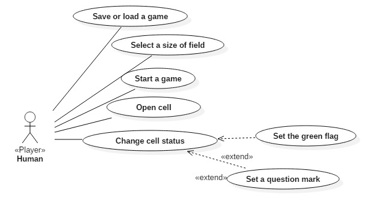
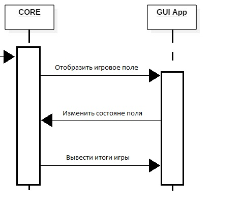
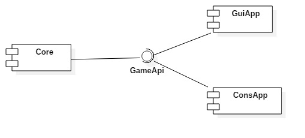

# --------------- MIN∑SᏔEEᎵER ---------------

## Задание
Реализовать логическую игру "Сапер".

Игра будет происходить в оконном режиме на 3х вариантах поля на выбор пользователя (в зависимости от выбранного уровня сложности) по правилам,описанным ниже. Должно быть реализовано сохранение текущей игры и загрузка игры с последнего момента. Должен присутствовать таймер, считающий время, прошедшее с начала игры. Программа должна определять победителя и выводить на экран соответствующее сообщение.
## Описание игры:

--------- Цель игры ---------

- Найти пустые ячейки, но не трогать ячейки, содержащие мины. Чем быстрее вы очистите всю доску, тем лучше будет результат.

--------- Игровая доска ---------

В игре «Сапер» есть три стандартные доски, каждая следующая сложнее предыдущей.

- Новичок: 81 ячейка, 10 мин

- Любитель: 256 ячеек, 40 мин

- Профессионал: 480 ячеек, 99 мин

--------- Правила игры ---------

- Если открыта ячейка с миной, игра проиграна.

- Если открыта пустая ячейка, игра продолжается.

- Если в ячейке указано число, оно показывает, сколько мин скрыто в восьми ячейках вокруг данной. Это число помогает понять, где находятся безопасные ячейки.

## Концепция 

Готовым проектом является графическое приложение, реализующее взаимодействия с ядром игры. Игроку отображается стартовое меню с возможностью выбрать один из трех уровней сложности игры (новичок, любитель и профессианал). После старта игры отображается игровое поле, таймер, счетчик свободных клеток и оставшихся мин. В ходе игры можно выйти с сохранением текущих показателей поля и таймера для последующего возобновления игры с текущего момента.

## Минимально работоспособный продукт (Minimum viable product)
Консольное приложение реализующее взаимодействие с ядром игры. 
Возможные действия: 

- Отобразить информацию о поле (какие ячейки открыты, какие - нет, и сколько мин находятся рядом с выбранной ячейкой)
   
- Вскрыть ячейку или установить на ней флаг

Также это приложение должно определять конец игры и информировать об этом игрока.   

## Диаграмма прецедентов использования

## Диаграмма последовательностей
 
## Диаграмма компонентов
 
